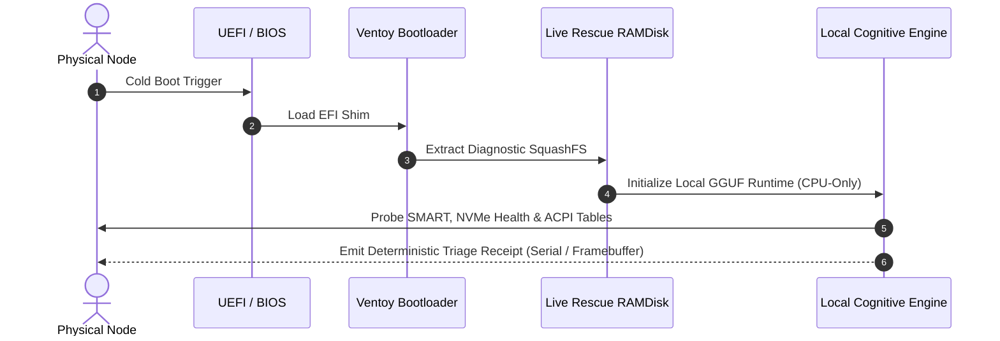

# ✦ VENTOY-AI: AUTONOMOUS OFFLINE RECOVERY RUNTIME ✦
*Hardware-Level Triage & Embedded Cognitive Diagnostic Harness at Boot*

---

## The Fatal Flaw in Modern Disaster Recovery

Every standard IT rescue media shares a fatal vulnerability: **it assumes a functioning network.**

When a server drops into kernel panic, ransomware locks the network stack, or boot sectors corrupt at 3:00 AM, traditional cloud-dependent assistants are dead on arrival. You are left staring at a raw EFI shell with zero context and compounding downtime.

**Ventoy-AI eliminates this blind spot.** By pairing Ventoy's multi-ISO partition engine with an embedded, quantized local language model (GGUF via llama.cpp/Ollama runtime), this repository delivers an air-gapped, self-contained diagnostic engine that evaluates hardware telemetry, inspects partition tables, and executes remediation scripts *before* the host operating system touches RAM.

---

## Architectural Topography

```
USB Physical Drive (Dual-Partition Architecture)
├── Partition 1: VTOYDATA (exFAT/ext4 — High-Capacity Recovery Vault)
│   ├── configs/                  # Ventoy boot scripts, theme engine & partition maps
│   ├── docs/                     # Unattended installation pipelines (Tiny11 + Windsurf)
│   ├── iso-build/                # AI Control Center live image & squashfs overlays
│   └── models/                   # Quantized offline diagnostic models (1.5B–3B GGUF)
└── Partition 2: VTOYEFI (FAT16 — UEFI Bootloader & Hardware Prober)
    └── EFI/BOOT/                 # SecureBoot-signed Grub/Shim loaders
```

### Core Subsystems

| Subsystem | Directory | Technical Function |
|---|---|---|
| **Ventoy Automation** | [`configs/`](configs/) | Automated boot configuration, menu timeouts, and multi-distro chaining parameters. |
| **Recovery Pipelines** | [`docs/`](docs/) | Blueprints for headless deployment of minimal rescue kernels and optimized Windows PE (Tiny11). |
| **AI Control Center** | [`iso-build/`](iso-build/) | Alpine/Arch-based minimal ramdisk packaging local inference binaries and serial consoles. |
| **Orchestration Scripts**| [`scripts/`](scripts/) | Partition verification, disk flashing, and automated integrity validation suites. |

---

## Hardware-Level Diagnostic Flow



---

## Deployment & Verification

### 1. Requirements
- 1x USB 3.2 Gen 1+ Flash Drive ($\ge 32\text{ GB}$).
- Linux Host with `parted`, `mkfs.vfat`, and `dd` installed.
- Target hardware with x86_64 UEFI firmware.

### 2. Drive Provisioning
```bash
# Verify disk identity (ensure sdc is your target drive)
lsblk -d -o NAME,SIZE,MODEL

# Execute partition mapping and config synchronization
bash scripts/setup-ventoy-partitions.sh /dev/sdc
```

### 3. Offline Model Verification
Validate that the embedded model matches the hardware memory ceiling ($\le 2\text{ GB}$ resident memory footprint):
```bash
sha256sum models/qwen2.5-coder-1.5b-instruct-q4_k_m.gguf
```

---

## Invariant Safety Protocol

1. **Read-Only Mounting by Default**: Physical host disks are strictly mounted with `ro,noexec,nodev` during initial diagnostic scan.
2. **Zero Cloud Telemetry**: Outbound network adapters remain disabled until the operator issues explicit socket enablement.
3. **Deterministic Output**: Remediation recommendations output typed JSON logs to local RAMdisk memory.
